# Project Name

Embark on an exhilarating coding adventure with CS Ninja Web Application, where gaming meets programming challenges. Harness the power of HTML, CSS, JavaScript, PHP, and MySQL to unlock your coding potential and become a coding ninja in a captivating and immersive gaming environment.

  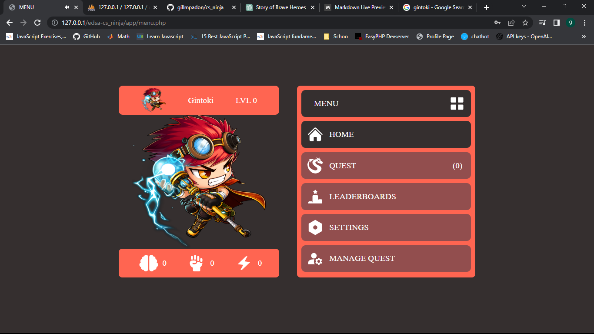

## Table of Contents
- [About the Project](#about-the-project)
- [Story](#story)
- [Heroes/Warriors](#heroeswarriors)
- [Developers](#developers)
- [Design](#design)
- [Actual](#actual)
## About the Project

CS Ninja Web Application is a project that combines frontend and backend technologies to create an immersive gaming experience with coding challenges. The frontend development utilizes HTML, CSS, and JavaScript to build an engaging and visually appealing user interface. The backend is powered by PHP, enabling dynamic content generation, user input processing, and interaction with the MySQL database. MySQL is used for efficient data storage and retrieval, managing game data, user information, and high scores. Together, these technologies work seamlessly to deliver a captivating and interactive gaming platform.

## Story

Once upon a time, in a land known as Dragon's Reach, a peaceful realm thrived under the protection of a benevolent dragon. The dragon, a majestic creature with shimmering scales and eyes that gleamed like precious gems, had forged an unspoken bond with the people of the land. For centuries, the dragon watched over the kingdom, ensuring harmony and prosperity.

But as time went on, a darkness began to fester within the heart of the dragon. Consumed by an unquenchable thirst for power, the once benevolent creature turned into a fearsome beast of destruction. Its eyes, once filled with wisdom and compassion, now burned with a fiery rage that threatened to engulf the entire land.

News of the dragon's descent into madness spread like wildfire, reaching the ears of Hiroshi, Ryota, Kazuki, Takumi, Sakura, Hikari, and Aya. Each of them possessed unique abilities and powers that made them the kingdom's last hope against the dragon's tyranny.

## Heroes/Warriors

### Hiroshi - The Electric Inventor

  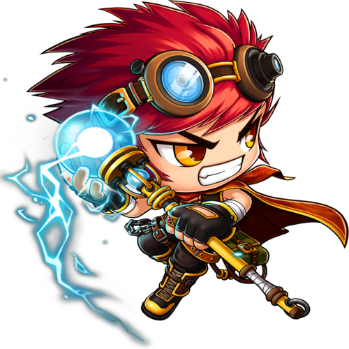

Hiroshi, a brilliant and innovative wizard, is renowned for his mastery of lightning magic and his incredible inventions. Holding a staff infused with immense electric power, Hiroshi can unleash bolts of lightning that crackle with energy. He is known as the Electric Inventor due to his ability to harness and control electricity like no other. His inventions and magical prowess have made him a respected figure in the wizarding community.

### Ryota - The Wind Archer

  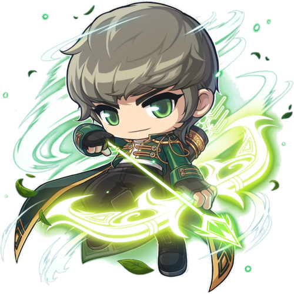

Ryota, a wizard with an affinity for the wind element, draws his power from the ancient elves. He is equipped with a magical bow and arrows crafted from the essence of the wind itself. As the Wind Archer, Ryota can summon gusts of wind, manipulate air currents, and launch arrows that carry the force of the wind's might. His connection to nature and mastery of wind magic make him an agile and formidable opponent on the battlefield.

### Kazuki - The Assassin

  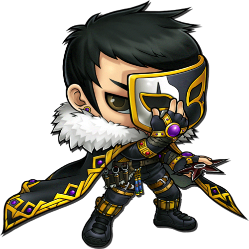

Kazuki is a mysterious and skilled assassin who operates in the shadows. With his black armor and a mask concealing his identity, he strikes fear into the hearts of his enemies. Kazuki wields a deadly dagger with precision and speed, making him a formidable close-quarters combatant. He comes from a royal lineage but chose the path of stealth and darkness to protect the kingdom from threats that lurk in the shadows.

### Takumi - The Mighty Warrior

  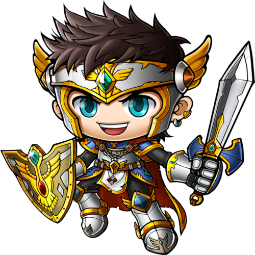

Takumi, the captain of the castle warriors, is a towering figure with immense strength. Clad in armor and wielding a shield and sword, he stands as a beacon of hope and inspiration for his comrades. Known as the Mighty Warrior, Takumi leads by example, fearlessly charging into battles, and displaying remarkable resilience. His unwavering determination and strategic mind have earned him respect both on and off the battlefield.

### Sakura - The Princess of Water

  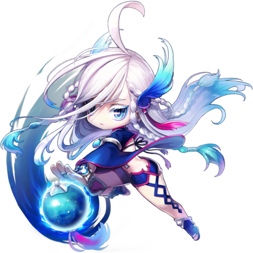

Sakura, born of the goddess of water, possesses the inherent power of the water element. As the Princess of Water, she can command and manipulate water with ease. Her abilities include summoning torrents of water, creating protective barriers, and healing wounds. Sakura's serene demeanor and compassionate nature guide her as she uses her water magic to bring balance and harmony to the world.

### Hikari - The Fiery Sorceress

  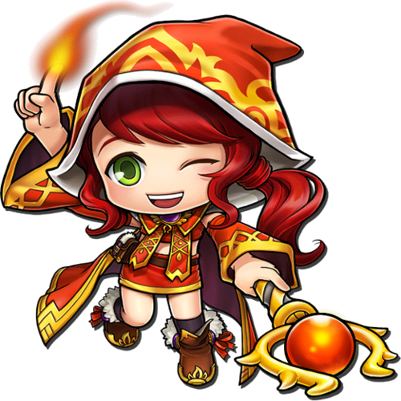

Hikari, the daughter of powerful witches, possesses the gift of fire manipulation. She can summon flames in her hands, creating fiery displays of immense heat and power. Hikari's control over the fire element is unrivaled, and her skills as a sorceress allow her to wield flames with grace and precision. With her fiery nature and determination, she embraces her role as the Fiery Sorceress, using her powers to protect her loved ones and uphold justice.

### Aya - The Princess Shieldmaiden

  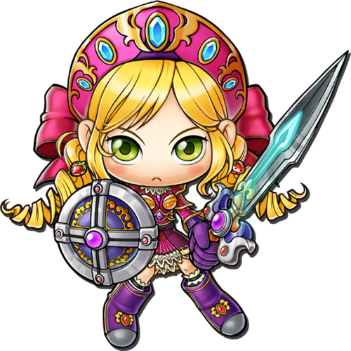

Aya, a courageous and determined princess, is known as the Shieldmaiden. She carries a shield and a sword, ready to defend her kingdom with unwavering loyalty. Aya is skilled in both offense and defense, embodying the spirit of a true warrior. Despite her noble lineage, she eschews a life of luxury, opting to lead from the frontlines, protecting her people, and standing against any who threaten their safety.

### Yumi - The Royal Archery

  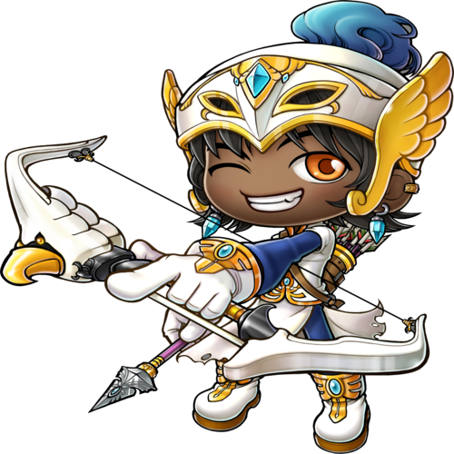

Yumi, a member of the royal family, possesses unparalleled skill with a bow and arrow. Her precision and accuracy make her the kingdom's finest archer. Yumi's regal upbringing has instilled in her a sense of duty and grace, which she carries into battle. With her bow in hand, she strikes from a distance, swiftly eliminating foes with her expert marksmanship. Yumi's prowess as an archer has become the stuff of legends, earning her the title of the Royal Archery.

## Developers

  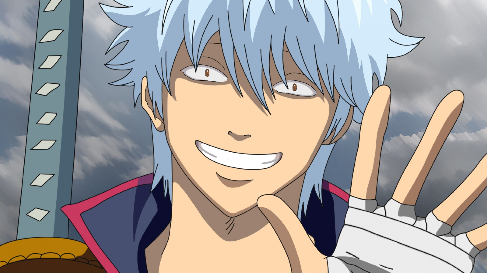

I am thrilled to introduce myself as the creator of an exciting web application called CS Ninja. My name is Gillbert Padon, and I am a passionate student developer who embarked on this web development journey to bring a unique and engaging experience to coding enthusiasts like myself.

CS Ninja is a captivating game that combines programming challenges with strategic gameplay. It is designed to enhance coding skills while providing an immersive and fun environment. As a student developer, I wanted to create an app that not only entertains but also educates and inspires players to become coding ninjas.

The idea behind CS Ninja was to develop a platform where players can control a team of brave warriors with distinct abilities and powers. These characters include Hiroshi, Ryota, Kazuki, Takumi, Sakura, Hikari, Aya, and Yumi. Each of them possesses unique strengths, such as lightning magic, wind manipulation, stealth, and more. Players can guide these heroes through exciting quests, answering programming questions to earn points and level up their characters.

## Design
This is the Link for my figma design. [CS NINJA PROTOTYPE](https://www.figma.com/file/Z7muGaCU7jqXD6VlquTrRJ/WEB-PROJECT?type=design&node-id=35%3A2&t=lF0RXh7Bai097F8K-1).

  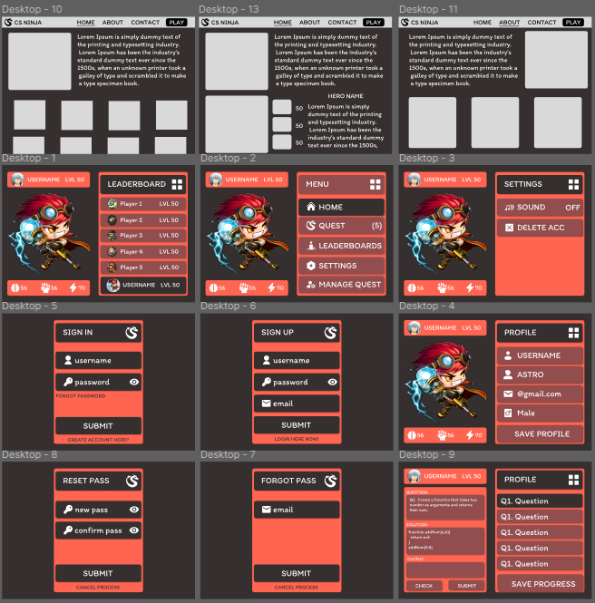

  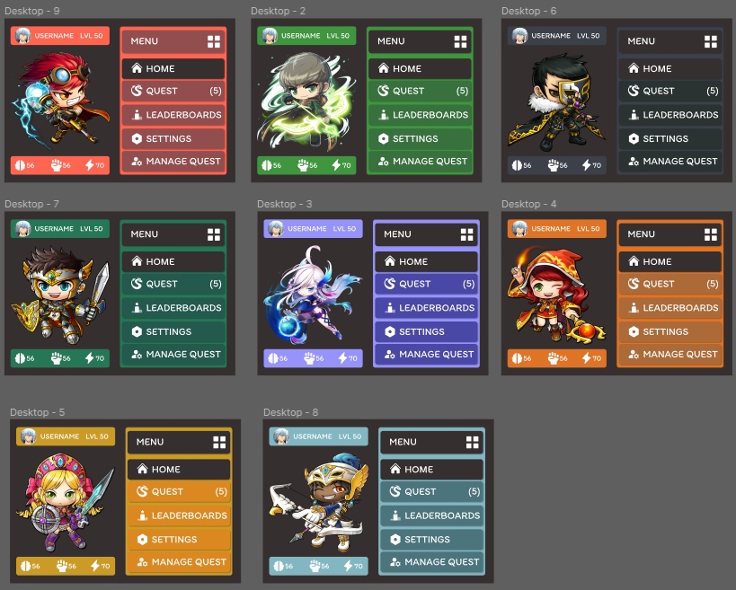

## Actual
This is the actual game provided.

  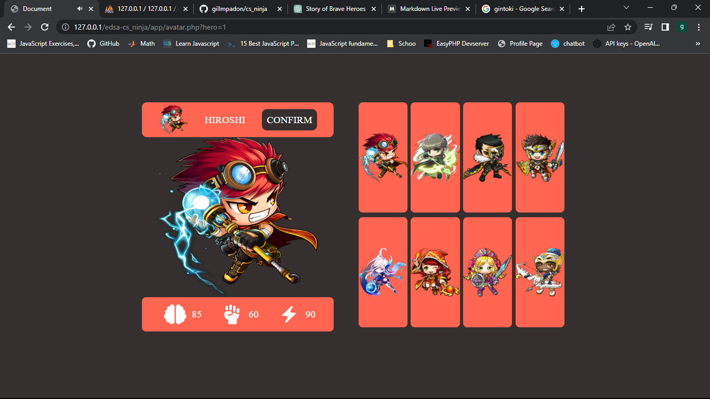

  

